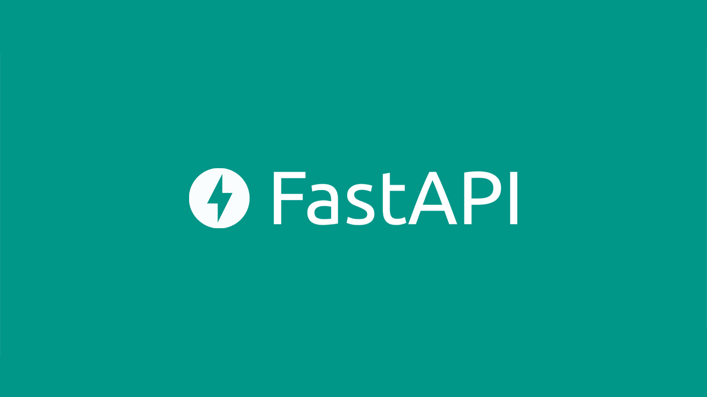

# scrape weather and fuel prices
In this project I used apache airflow to scrape website periodically. This is for the tutorials I do on youtube. You can checkout my channel [here](https://www.youtube.com/channel/UCzSlSeJ4XH4bWH79DKmIxjg). I do data science and data engineering videos for projects like these.
## Technologies used
&nbsp;&nbsp;&nbsp;&nbsp;

&nbsp;&nbsp;&nbsp;&nbsp;

## using the project
You can follow these steps to setup and you can use [this video]() to help you understand what is going on.
1. Clone this repository.
2. cd into the repo 
```
cd scrape-epl-news
```
3. Run `setup_steps` to install dependencies. Make sure you are using `pyenv` to manage your python versions and `python 3.10.0` is installed in the pyenv manager.
```
bash scripts/setup_steps.sh
```

## setting up airflow

source venv activate

export PYTHONPATH

export AIRFLOW_HOME

airflow version

sql_alchemy_conn

airflow db init

airflow users create --username dalmas --firstname Dalmas --lastname Otieno --role Admin --email dalmas@dalicodes.com --password dalmaspassword
